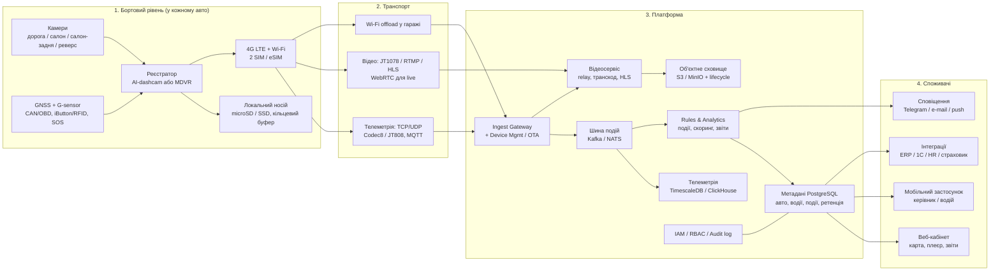
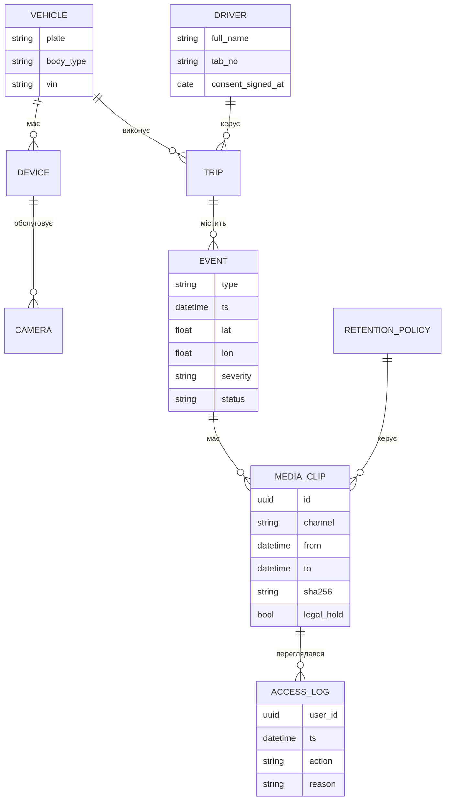

# 02. Базова архітектура системи

## 1. Загальна схема (4 рівні)



## 2. Рівень 1 — борт (Edge)

Ключовий архітектурний принцип: **важке відео живе на борту, у хмару йде тільки те, що потрібно.**
Це головний важіль вартості — безперервна трансляція 1 каналу 1080p ≈ 140 ГБ/міс.,
подієве вивантаження ≈ 2–5 ГБ/міс. Різниця в рахунку за трафік — десятикратна.

**Склад:**
- **Реєстратор.** Для седана/SUV — інтегрована AI-дашкам (2–3 канали, вбудовані GNSS/4G/DMS).
  Для мікроавтобуса — MDVR-бокс (4–8 каналів, SSD/HDD).
- **Локальне сховище** з кільцевим буфером: 7–14 діб безперервного запису.
- **Edge-AI** (за наявності NPU): DMS/ADAS-детекція виконується на борту; у хмару йде
  подія + короткий кліп, а не потік. Це і приватність, і трафік.
- **Живлення**: постійна лінія + реле запалювання, відсічка за напругою (NFR-08).
- **Антисаботаж**: журнал відключень живлення, детект перекриття об'єктива, вилучення носія.

**Політика запису (критично для правового боку):**
```
if (робочий_час(зміна_водія) AND запалювання == ON) -> дорожня камера: безперервно
                                                    -> салонна камера: безперервно на борт
if (подія) -> кліп ±15 c у хмару
if (поза робочим часом OR приватна геозона) -> салонна камера: ВИМК., лише телеметрія
```

## 3. Рівень 2 — транспорт

| Канал | Протокол | Призначення | Обсяг |
|-------|----------|-------------|-------|
| Телеметрія | Teltonika Codec 8 / JT808 / MQTT over TLS | координати, події, статуси | ~30–80 МБ/міс. |
| Подієве відео | HTTPS multipart / RTMP push | кліпи по тригерах | ~1–3 ГБ/міс. |
| Live-перегляд | JT1078 → HLS, або WebRTC | «подивитись зараз» | ~0,6 ГБ/год 720p |
| Архів по запиту | HTTP range / FTP | вибіркові фрагменти | за фактом |
| Масовий offload | Wi-Fi у гаражі | добові архіви, оновлення | 0 ₴ мобільного трафіку |

Безпека каналу: mTLS з індивідуальним сертифікатом пристрою, ротація ключів через OTA,
відсутність «дефолтних паролів» (типова вразливість китайських MDVR).

## 4. Рівень 3 — платформа

Модулі (можуть бути як мікросервіси, так і моноліт — на старті достатньо моноліту):

| Модуль | Відповідальність |
|--------|------------------|
| **Ingest Gateway** | термінація протоколів пристроїв, автентифікація, нормалізація |
| **Device Manager** | реєстр пристроїв, конфігурації, OTA, здоров'я, SIM/трафік |
| **Telemetry Store** | часові ряди (TimescaleDB/ClickHouse), треки, агрегати |
| **Media Service** | прийом кліпів, транскодування, пакування HLS, live-relay |
| **Object Storage** | S3-сумісне сховище + lifecycle-правила (hot 30 д → cold 90 д → delete) |
| **Rules Engine** | геозони, ліміти швидкості, робочий календар, кореляція подій |
| **Scoring & Reports** | рейтинг водіїв, звіти, експорт |
| **IAM / Audit** | ролі, доступи, незмінний журнал переглядів (FR-31) |
| **Retention & Legal Hold** | автовидалення, заморозка матеріалів, DSAR-експорт |
| **Integration API** | REST/webhook для ERP, 1С, HR, страхових |

### Модель даних (спрощено)



## 5. Рівень 4 — споживачі

- **Веб-кабінет**: карта, плеєр «трек+відео», стрічка подій, звіти, адмінка.
- **Мобільний застосунок керівника**: live-погляд, події, підтвердження візитів.
- **Застосунок водія**: авторизація (заміна iButton), статус зміни, власний рейтинг — інструмент
  прийняття системи персоналом («бачу те саме, що й керівник»).
- **Сповіщення**: Telegram-бот/e-mail/push, ескалація за severity.
- **Інтеграції**: дорожні листи, HR-табель, ERP, страховик.

## 6. Наскрізні аспекти

### 6.1 Приватність за задумом (Privacy by Design)
- Салонна камера пише **на борт**, у хмару — лише подієві кліпи.
- Аудіо вимкнено на рівні прошивки.
- Доступ до салонного відео — окрема роль + обов'язкове поле «підстава перегляду».
- Автовидалення за розкладом; вручну видалити «незручний» запис неможливо (тільки legal hold продовжує).
- Квартальний звіт DPO: скільки переглядів, ким, з якою підставою.

### 6.2 Стійкість
- Черга на борту + докачування (FR-13) — платформа може лежати, дані не втрачаються.
- Резервна SIM іншого оператора (NFR-09).
- Глушіння GNSS: числення шляху за акселерометром/одометром (NFR-15).
- Бекапи метаданих щодня, відео — реплікація в другий регіон для інцидентних матеріалів.

### 6.3 Спостережуваність
Метрики: онлайн-пристрої %, лаг телеметрії, черга вивантажень, трафік на авто,
частка «мертвих» камер, вартість зберігання. Алерти на деградацію ще до скарг користувачів.

## 7. Три опції реалізації платформи

| Опція | Суть | Плюси | Мінуси |
|-------|------|-------|--------|
| **A. Готовий SaaS (захід)** | Samsara / Motive / Lytx / Netradyne / Webfleet | найшвидший старт, зріла аналітика, підтримка | найдорожче, контракт 1–3 роки, дані поза Україною, залежність від вендора |
| **B. Український інтегратор** | Bitrek/Streamax/Howen/Teltonika + локальна платформа (Wialon, FreeTrack, Fleetix, Тех Контроль) | ціна, сервіс і монтаж на місці, документи й ПДВ, мова | аналітика слабша за західну, якість різниться між інтеграторами |
| **C. Self-hosted** | китайське залізо (JT1078) + Traccar 6.13+/власний сервіс + MinIO | найнижча вартість підписки, повний контроль даних | потрібен свій DevOps (0,2–0,5 FTE), відповідальність за безпеку і апдейти |

**Рекомендація на старт** — див. `05-tco.md`: до ~50 авто економічно виграє **B**,
понад ~100–150 авто **C** починає окупати власну команду, **A** виправданий там, де
критична готова методологія коучингу водіїв і страхові знижки.

## 8. Ключові архітектурні рішення (ADR-кандидати)

| # | Рішення | Обґрунтування |
|---|---------|---------------|
| ADR-1 | Edge-first: відео зберігається на борту, хмара отримує події | −90% трафіку і вартості зберігання |
| ADR-2 | Wi-Fi offload у гаражі як штатний канал архівів | мобільний трафік лише на критичне |
| ADR-3 | Салонна камера — подієво, не постійно в хмару | приватність + вартість |
| ADR-4 | Обладнання лише зі стандартними протоколами (JT808/JT1078, Codec 8) | уникнення vendor lock-in (NFR-13) |
| ADR-5 | Незмінний журнал аудиту переглядів | вимога правового блоку, захист самої компанії |
| ADR-6 | Ретенція як код (політики в конфігурації, не «за домовленістю») | доказовість перед перевіркою |
