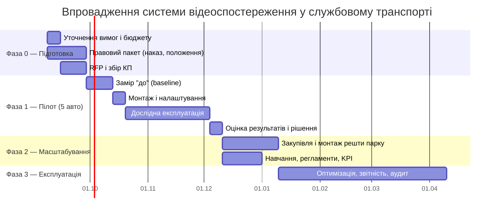

# 07. План впровадження та наступні кроки

## 1. Фази

## 2. Фаза 0 — підготовка (2–4 тижні)

| Крок | Результат | Відповідальний |
|------|-----------|----------------|
| Затвердити цілі та KPI (`01-vymohy.md`, розділ 1) | підписаний перелік метрик | замовник |
| Інвентаризація парку: моделі, вік, тип кузова, наявна телематика | таблиця авто | автогосподарство |
| Визначити бюджетну межу (₴/авто/міс.) | цифра для відсіву варіантів | фінанси |
| Правовий пакет (`06-pravo.md`, п. 4) | 11 документів | юрист + HR |
| RFP за шаблоном (`05-tco.md`, п. 6) до 4–6 постачальників | порівняльна таблиця КП | проєктна група |
| Комунікація персоналу: зустріч, роз'яснення «навіщо» | зменшення саботажу | керівники підрозділів |

**Критично:** правовий пакет і комунікація стартують **одночасно** із закупівлею, а не після.
Найчастіша причина провалу таких проєктів — не техніка, а опір персоналу і зіпсоване обладнання.

## 3. Фаза 1 — пілот (2 місяці, 5 авто)

Склад пілоту: 2 седани + 2 SUV + 1 мікроавтобус — по одному представнику кожної конфігурації
плюс дублювання найпоширенішого типу.

**Перед монтажем — 2 тижні заміру baseline** (пальне, пробіг, к-сть інцидентів). Без цього
неможливо довести ефект і захистити бюджет фази 2.

Тестуємо 2 постачальників паралельно (по 2–3 авто) — це єдиний спосіб реально порівняти
якість нічного відео, стабільність 4G та зручність інтерфейсу.

**Виходи пілоту:**
- Заміряні: реальний трафік на авто, % часу онлайн, к-сть хибних спрацювань DMS.
- Протестовані: сценарій «інцидент → доказовий пакет за 30 хв», Wi-Fi offload, заміна пристрою.
- Зібрані: відгуки водіїв, зауваження юриста, фактична вартість монтажу.
- Рішення: масштабувати / змінити постачальника / переглянути конфігурацію.

## 4. Фаза 2 — масштабування (1–2 місяці)

Монтаж хвилями по 8–10 авто, щоб не зупиняти роботу. Кожна хвиля — акт із фото,
серійними номерами, підписом водія про ознайомлення. Паралельно — навчання диспетчерів
роботі зі стрічкою подій і регламент реагування (хто, за скільки хвилин, що робить).

## 5. Фаза 3 — експлуатація

- Щомісячний звіт: події, рейтинг водіїв, пальне, трафік, стан пристроїв.
- Щоквартальний звіт DPO: перегляди архіву та їх підстави.
- Перегляд порогів подій після 3 місяців — початкові налаштування завжди дають шум.
- Річний перегляд контракту й TCO проти фактичних цифр (`tools/tco.py` з реальними даними).

## 6. Ризики та мітигація

| Ризик | Ймовірність | Вплив | Мітигація |
|-------|:-----------:|:-----:|-----------|
| Опір і саботаж персоналу (заклеєні камери, «випадкові» відключення) | висока | високий | комунікація «навіщо», доступ водія до власних даних, детект саботажу (FR-23), дисциплінарна процедура |
| Перевитрата мобільного трафіку | висока | середній | Wi-Fi offload, подієве вивантаження, ліміт із деградацією якості (FR-14) |
| Юридична вразливість системи | середня | **критичний** | повний пакет документів до запуску (`06-pravo.md`) |
| Розряд АКБ на стоянці | середня | середній | відсічка за напругою (NFR-08), контроль на пілоті |
| Слабке нічне відео / тонування | середня | середній | тест на пілоті **до** масової закупівлі |
| Vendor lock-in, зростання ціни підписки | середня | високий | стандартні протоколи (ADR-4), фіксація ціни в контракті, право на експорт даних |
| Глушіння GNSS | висока (UA) | середній | числення шляху, прив'язка подій до відео, не лише до координат |
| Пошкодження/крадіжка обладнання | низька | низький | підмінний фонд 5–10% від парку |

## 7. Що потрібно від замовника для наступного кроку

Три відповіді, які визначають усе інше:

1. **Розмір парку сьогодні і план на 3 роки** — це вибір між сценарієм B і C (`05-tco.md`, п. 3).
2. **Бюджетна межа**: ₴/авто/міс. і чи є CAPEX на купівлю заліза, чи потрібна оренда/підписка.
3. **Глибина контролю салону**: подієві кліпи (рекомендовано) чи постійний доступ до салонного відео —
   від цього залежать і правовий пакет, і трафік, і реакція персоналу.

Додатково корисно: чи є вже GPS-моніторинг (яка платформа), чи є гараж/стоянка з Wi-Fi,
чи є власний ІТ-персонал для варіанта C.
